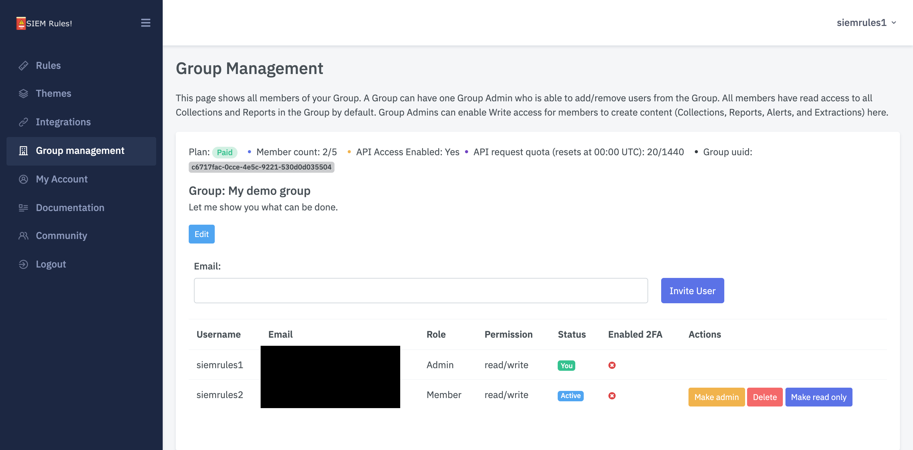

# Group Management

## Groups 

### Group Management 

Each user belongs to a Group. A user can only belong to one Group.

Each Group has one Group Admin. By default this is the creator of the Group, however, ownership can be reassigned to any active Member of the Group.

A Group Admin can:

* invite new Members to the Group
  * user invited can choose to accept or reject invite
* delete existing Members from the Group
  * note a user can also do this for themselves on the "My Profile" page.
  * deleting an account will delete that Members personal information (inc. API keys) but any content created by the Member (e.g. Rules and Themes) will remain available to the Group
* edit user permissions for member of the Group
  * see User Permissions section below

Use the Group Management page for this: [https://app.siemrules.com/group/group\_manage/](https://staging-01.siemrules.com/group/group\_manage/)​

### Group Plans 

Each Group has a plan. By default, the free plan is assigned at sign up. Any user of the group can request a plan upgrade.You can see a current list of plans and their restrictions here: [https://www.siemrules.com/pricing/](https://www.siemrules.com/pricing/)​

## Users 

### User Permissions 

There are two user permissions available, read and read/write. You can see what functions are available for each permission type below:

| Function                      | Read   | Read/write |
| ----------------------------- | ------ | ---------- |
| View public Rule              | TRUE   | TRUE       |
| View private Rule (in Group)  | TRUE ! | TRUE !     |
| Create/Clone Rule             | FALSE  | TRUE       |
| Edit Rule                     | FALSE  | TRUE       |
| Delete Rule                   | FALSE  | TRUE       |
| View public Theme             | TRUE   | TRUE       |
| View private Theme (in Group) | TRUE ! | TRUE !     |
| Create Theme                  | FALSE  | TRUE       |
| Edit Theme                    | FALSE  | TRUE       |
| Delete Theme                  | FALSE  | TRUE       |
| Generate API key              | TRUE ! | TRUE !     |

_! if supported in plan_

### User Security 

Two-factor authentication to all users. It is strongly recommended that all users configure two-factor authentication.


A 10% discount will be applied on Group Plans where all members have two-factor authentication enabled.


Group admins can view which of their Group Members have two-factor authentication enabled on the Group Management page: [https://app.siemrules.com/group/group\_manage/](https://staging-01.siemrules.com/group/group\_manage/)

### User account removal

​In addition to Group admins, a user can delete their own account. Deleting n account will remove a Members personal information (inc. API keys) but any content created by the Member (e.g. Rules and Themes) will remain available to the Group
