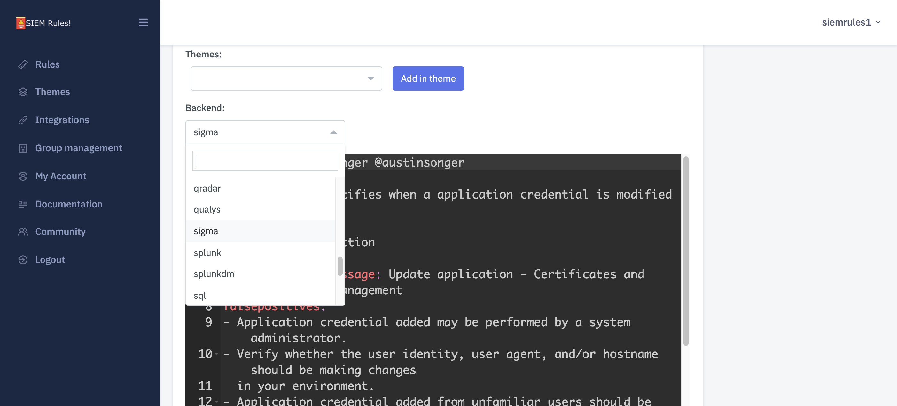

# Rule Management

## Rules

### Overview 

SIEM Rules allows you to create and modify rules in the open-source Sigma format.

You can read more about Sigma rules and how they are constructed in the Sigma repository on GitHub:



We have also created a short series of posts you might find useful if you are new to the Sigma format:



### Rule Conversion 

Once you've created a Rule in Sigma format in the SIEM Rules user interface, it can be converted to another backend schema.

You can view the available backend schemas for conversion in the SIEM Rules.

Note: due to the way Rules can be constructed, not all Rules can be converted to every backend type. If this is the case, you will see this message returned: `This format is not supported for this rule.`

### Rule Versioning 

## Themes 

### Overview 

Rules can be grouped into Theme. A Theme can represent anything you want, bit generally Themes are collections of Rules based a certain topic (e.g. campaign or too).

Themes can contain any public Rule, or private Rules belonging to your Group.

.png>)

### Theme Visibility 

Themes can be set to be:

* Public (default):
  * anyone can view (including unauthenticated users)
  * can contain any public Rule
  * can contain a private rule from your Group (will not be visible to anyone outside your Group)
* Private (if plan supported)
  * only Group members can view
  * can contain any public Rule (will not be visible to anyone outside your Group)
  * can contain a private rule from your group (will not be visible to anyone outside your Group)

Note, visibility cannot be changes once the Theme has been created.
