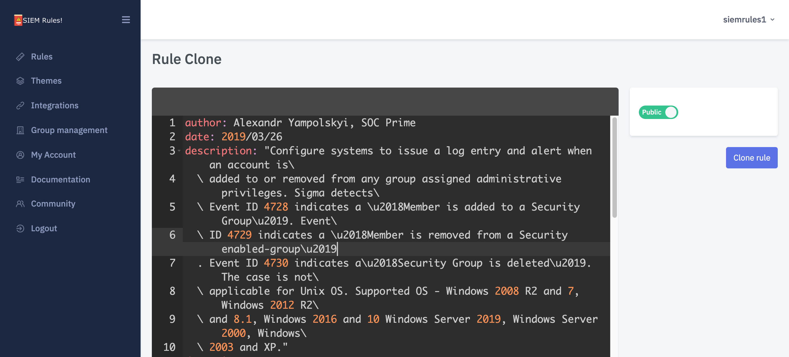

# Rule Management

## Rules

### Overview 

SIEM Rules allows you to create and modify rules in the open-source Sigma format.

You can read more about Sigma rules and how they are constructed in the Sigma repository on GitHub:



We have also created a short series of posts you might find useful if you are new to the Sigma format:



### Content 

At a minimum the following fields must be defined for a Rule:

* title
* logsource
* detection

However, it is strongly recommended to include more fields to improve the quality of your Rule.

Some of these fields are shown in the user interface: [https://app.siemrules.com/rule/create/](https://staging-01.siemrules.com/rule/create/)

[The Sigma wiki page here offers much more guidance to assist](https://github.com/SigmaHQ/sigma/wiki/Specification).

### Converting (backend type) 

Once you've created a Rule in Sigma format in the SIEM Rules user interface, it can be converted to another backend schema.

You can view the available backend schemas for conversion in the SIEM Rules user interface or via the API.

Note: due to the way Rules can be constructed, not all Rules can be converted to every backend type. If this is the case, you will see this message returned: `This format is not supported for this rule.`

### Versioning 

Each rule has a unique version. Newly created (or Cloned) Rules always start at v1.0.

SIEM Rules implements a major and minor version system. You can define what a major and minor update should be when editing a rule, as a general idea we recommend to use a

* major update: when updating detection or logsource content
* minor update: when updating metadata of the rule, like description or falsepositive values

The user interface and API will always show the latest version of the rule by default, but you can view earlier versions as you wish.

### Cloning 

It is possible to copy (Clone) a Rule. You can Clone any rule that is visible to you in the user interface of SIEM Rules.

You can clone any version of a Rule.

When cloning a rule you can choose wether it should be public or private (visibility).

When a rule has been Cloned, it will start from version 1.0 as if it was created from new, with any version history lost.

## Themes 

### Overview 

Rules can be grouped into Theme. A Theme can represent anything you want, bit generally Themes are collections of Rules based a certain topic (e.g. campaign or too).

Themes can contain any public Rule, or private Rules belonging to your Group.

.png>)

### Theme Visibility 

Themes can be set to be:

* Public (default):
  * anyone can view (including unauthenticated users)
  * can contain any public Rule
  * can contain a private rule from your Group (will not be visible to anyone outside your Group)
* Private (if plan supported)
  * only Group members can view
  * can contain any public Rule (will not be visible to anyone outside your Group)
  * can contain a private rule from your group (will not be visible to anyone outside your Group)

Note, visibility cannot be changes once the Theme has been created.

### Creating a Theme 

You can create a Theme here: [https://app.siemrules.com/theme/create/](https://staging-01.siemrules.com/theme/create/)

To create a Theme you can set the following fields:

* Title (required)
* Description (optional)
* Tags (optional)
* Visibility (required)

### Adding a Rule to a Theme 

You can add a Rule to a Theme on the individual Rule page.

Choose the Theme (must already exist) from the dropdown Theme menu and select "add to Theme".
