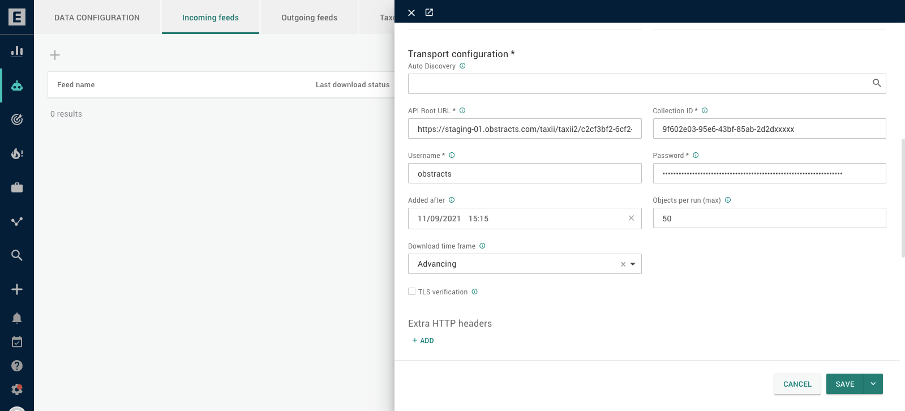

# EclecticIQ Intelligence Center

### Prerequisites

[An SIEM Rules plan that supports use of our API.](https://www.siemrules.com/pricing/)

### Setup

1. Navigate to the incoming feed setup page
2. Select add new feed
3. You can set most fields as you wish, the key ones are
   1. **Transport type:** TAXII 2.1 poll
   2. **Content type:** STIX 2.1
   3. **API Root URL:** https://app.siemrules.com/taxii/taxii2/A-GROUP-UUID _(_A-GROUP-UUID [can be obtained on the theme list view in the SIEM Rules web app](https://app.siemrules.com/theme/list/)_)_
   4. **Collection ID:** THEME-UUID (THEME-UUID [can be obtained on the theme list view in the SIEM Rules web app](https://app.siemrules.com/theme/list/)_)_
   5. **Username:** SIEM Rules username
   6. **Password:** SIEM Rules API key
   7. **Added after:** _should be no more than 7 days_ because our TAXII feed does not return any more data than this
   8. **Objects per run (max):** 50
   9. **Download time frame:** advancing

Now click save, and you should see intelligence being ingested.&#x20;

### Usage

Once incoming feed is enabled, the ingested detection rules can be used in the EclecticIQ Intelligence Center.
